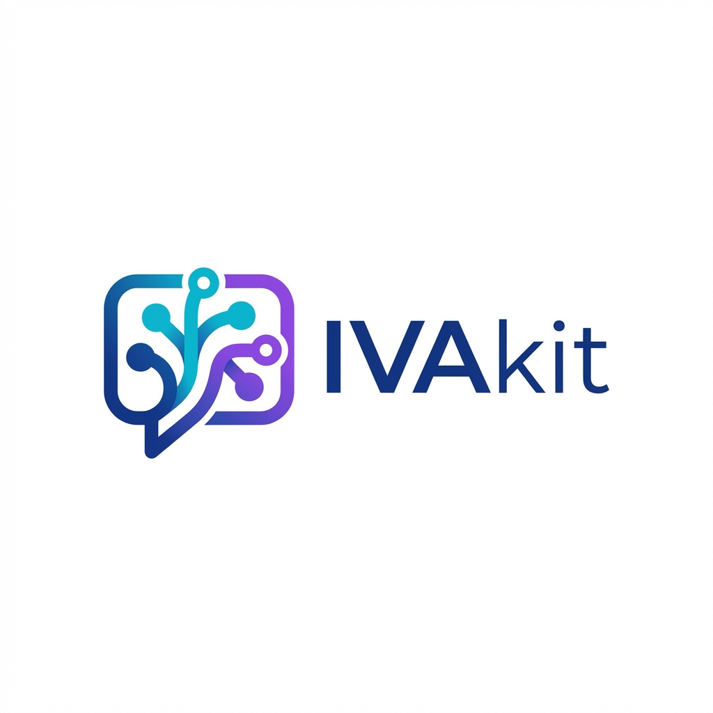

<<<<<<< HEAD
# IVAkit
IVAkit is an open-source, no-code platform for building intelligent virtual agents for contact centers. It lets teams visually design conversation flows, connect tools and knowledge, simulate interactions, and run IVAs locally with modern, inspectable AI and a developer-friendly architecture.
=======
<p align="center">
  
</p>

<h1 align="center">IVAkit</h1>

<p align="center">
  <strong>Open-source no-code AI Intelligent Virtual Agent builder for contact centers</strong>
</p>

<p align="center">
  <a href="#features">Features</a> •
  <a href="#screenshots">Screenshots</a> •
  <a href="#quick-start">Quick Start</a> •
  <a href="#architecture">Architecture</a> •
  <a href="#documentation">Documentation</a> •
  <a href="#contributing">Contributing</a>
</p>

<p align="center">
  
  
  
</p>

---

## What is IVAkit?

IVAkit is a **visual, no-code conversation builder** and **runtime execution engine** for AI-powered Intelligent Virtual Agents (IVAs). It's designed for contact centers, CX teams, and AI engineers who want to build, test, and deploy conversational AI without writing code.

### Core Philosophy

- **Deterministic first, LLM second** - LLMs are tools, not magic
- **Local-first by default** - Run everything on your own infrastructure
- **No magic hidden behavior** - Everything is inspectable and auditable
- **Composable, versioned artifacts** - Flows are just JSON

> IVAkit IVAs are **systems**, not chatbots.

---

## Screenshots

### Visual Flow Builder

Build complex conversation flows using a drag-and-drop visual editor. Each node represents a step in the conversation, with clear visual indicators for node types and connections.


### Conversation Simulator

Test your flows in real-time with the built-in simulator. See the actual conversation as it happens, with intent detection, confidence scores, and response times.


### Debug View

Step through execution with the debugger. Inspect input/output at each node, see exactly what the LLM received and returned, and understand the flow's decision path.


---

## Features

### 🎨 Visual Flow Builder (Studio)

- Drag-and-drop node editor
- 9 node types for complete coverage
- Zoom, pan, snap-to-grid
- Keyboard shortcuts
- Dark mode
- Real-time validation

### 📦 Node Types

| Node | Purpose |
|------|---------|
| **Start** | Entry point, welcome message |
| **Message** | Send static/templated response |
| **Collect Input** | Wait for user input with validation |
| **LLM Router** | AI-powered intent classification |
| **Knowledge Search** | RAG retrieval from knowledge base |
| **Tool Call** | HTTP/webhook integrations |
| **Condition** | If/else branching logic |
| **Escalate** | Hand off to human agent |
| **End** | Terminate conversation |

### 🧪 Conversation Simulator

- Run flows live in browser
- Step-by-step execution
- Variable inspector
- Tool call logs
- LLM input/output viewer
- Token & latency estimation

### ⚡ Runtime Engine

- Loads published flow definitions (JSON)
- Executes node-by-node
- Maintains session state
- Channel-agnostic design
- Deterministic execution (except LLM nodes)
- Fully auditable

### 📚 Knowledge Base (RAG)

- Upload documents (txt, md, pdf)
- Chunk, embed, store locally
- Retrieval with confidence scores
- "Grounded-only" mode

### 📊 Analytics

- Conversations run
- Completion rate
- Fallback rate
- Avg turns
- Tool failures

---

## Tech Stack

| Layer | Technology |
|-------|------------|
| **Frontend** | Next.js 14, React Server Components, Tailwind CSS + shadcn/ui, React Flow, Framer Motion, Jotai |
| **Backend** | Bun, Hono, tRPC, Zod |
| **Database** | SQLite (libsql/Drizzle ORM) |
| **AI** | Ollama (local), OpenAI/Anthropic (optional cloud) |
| **Session State** | Redis-compatible |

---

## Quick Start

### Prerequisites

- [Node.js](https://nodejs.org/) 20+
- [pnpm](https://pnpm.io/) 8+
- [Bun](https://bun.sh/) (for API server)
- [Ollama](https://ollama.ai/) (optional, for local AI)

### Installation

```bash
# Clone the repository
git clone https://github.com/ivakit/ivakit.git
cd ivakit

# Install dependencies
pnpm install

# Copy environment variables
cp .env.example .env

# Start development servers
pnpm dev
```

This starts:
- **Studio** at http://localhost:3000
- **API** at http://localhost:3001

### With Docker

```bash
# Start all services
docker-compose up -d

# Seed demo data
pnpm db:seed
```

### Using Ollama (Local AI)

```bash
# Install Ollama
curl -fsSL https://ollama.ai/install.sh | sh

# Pull a model
ollama pull llama3.2

# IVAkit will automatically connect to Ollama at localhost:11434
```

---

## Project Structure

```
ivakit/
├── apps/
│   ├── studio/          # Next.js frontend (visual builder)
│   └── api/             # Hono + tRPC API server
├── packages/
│   ├── shared/          # Types, schemas, utilities
│   ├── database/        # Drizzle ORM + SQLite schema
│   ├── runtime/         # Flow execution engine
│   └── ai/              # LLM adapters (Ollama, OpenAI, etc.)
├── docs/                # Documentation
│   ├── flow-spec.md     # Flow Specification v1.0
│   └── screenshots/     # Application screenshots
└── docker/              # Docker configuration
```

---

## Architecture

```
┌─────────────────────────────────────────────────────────────┐
│                        IVAkit Studio                         │
│  ┌──────────────┐  ┌──────────────┐  ┌──────────────────┐   │
│  │ Node Palette │  │ Flow Canvas  │  │ Config/Simulator │   │
│  └──────────────┘  └──────────────┘  └──────────────────┘   │
└────────────────────────────┬────────────────────────────────┘
                             │ tRPC
                             ▼
┌─────────────────────────────────────────────────────────────┐
│                        API Server                            │
│  ┌──────────────┐  ┌──────────────┐  ┌──────────────────┐   │
│  │ Flow CRUD    │  │   Sessions   │  │    Analytics     │   │
│  └──────────────┘  └──────────────┘  └──────────────────┘   │
└────────────────────────────┬────────────────────────────────┘
                             │
         ┌───────────────────┼───────────────────┐
         ▼                   ▼                   ▼
┌─────────────────┐  ┌──────────────┐  ┌─────────────────┐
│  Flow Runtime   │  │   Database   │  │   AI Service    │
│  ┌───────────┐  │  │   (SQLite)   │  │  ┌──────────┐   │
│  │ Executor  │  │  └──────────────┘  │  │ Ollama   │   │
│  │ Handlers  │  │                    │  │ OpenAI   │   │
│  │ Session   │  │                    │  │ Rules    │   │
│  └───────────┘  │                    │  └──────────┘   │
└─────────────────┘                    └─────────────────┘
```

---

## Flow Specification

IVAkit uses a versioned Flow Specification (currently v1.0) that defines how conversation flows are structured. Flows are JSON documents that include:

- **nodes[]** - The steps in the conversation
- **edges[]** - Connections between nodes
- **variables[]** - Data passed between nodes
- **tools[]** - External integrations

See [docs/flow-spec.md](docs/flow-spec.md) for the complete specification.

### Example Flow (simplified)

```json
{
  "version": "1.0",
  "id": "flow_customer_support",
  "name": "Customer Support",
  "entryNode": "start_1",
  "nodes": [
    {
      "id": "start_1",
      "type": "start",
      "config": {
        "welcomeMessage": "Hello! How can I help you?"
      }
    },
    {
      "id": "router_1",
      "type": "llm_router",
      "config": {
        "intents": [
          { "name": "order_status", "targetNodeId": "..." },
          { "name": "refund", "targetNodeId": "..." }
        ]
      }
    }
  ],
  "edges": [
    { "source": "start_1", "target": "router_1" }
  ]
}
```

---

## AI Configuration

### Local (Default)

IVAkit uses Ollama by default for local AI inference:

```bash
# .env
OLLAMA_URL=http://localhost:11434
OLLAMA_MODEL=llama3.2
```

### Cloud (Optional)

To use OpenAI or Anthropic, set the API keys:

```bash
# .env
ENABLE_CLOUD_AI=true
OPENAI_API_KEY=sk-...
# or
ANTHROPIC_API_KEY=sk-ant-...
```

### Rules-Only Mode

For deterministic routing without AI:

```json
{
  "type": "llm_router",
  "config": {
    "model": { "provider": "rules" },
    "intents": [...]
  }
}
```

---

## Documentation

- [Flow Specification](docs/flow-spec.md) - Complete technical spec for flows
- [Node Reference](docs/flow-spec.md#node-types) - Detailed node documentation
- [API Reference](apps/api/README.md) - tRPC endpoint documentation
- [Contributing Guide](CONTRIBUTING.md) - How to contribute

---

## Development

### Commands

```bash
# Development
pnpm dev              # Start all apps in dev mode
pnpm dev:studio       # Start only Studio
pnpm dev:api          # Start only API

# Database
pnpm db:push          # Push schema changes
pnpm db:seed          # Seed demo data
pnpm db:studio        # Open Drizzle Studio

# Testing
pnpm test             # Run unit tests
pnpm test:e2e         # Run e2e tests

# Building
pnpm build            # Build all packages
pnpm lint             # Lint all packages
```

### Demo Flows

IVAkit comes with two demo flows:

1. **Customer Support** - Full-featured support IVA with intent routing, knowledge base, and escalation
2. **Order Tracking** - Simple order status lookup with validation

---

## Roadmap

### v0.2 (Next)
- [ ] Flow versioning & rollback
- [ ] Variable type validation
- [ ] Enhanced simulator with replay
- [ ] Webhook inbound channel

### v0.3
- [ ] Voice channel support (WebRTC)
- [ ] Twilio Media Streams adapter
- [ ] Real-time analytics dashboard

### v1.0
- [ ] Multi-tenant support
- [ ] Team collaboration
- [ ] Deployment management
- [ ] CCaaS integrations

---

## Contributing

We welcome contributions! Please see our [Contributing Guide](CONTRIBUTING.md) for details.

### Development Setup

1. Fork the repository
2. Create a feature branch
3. Make your changes
4. Add tests
5. Submit a pull request

### Code Style

- TypeScript strict mode
- Zod for all runtime validation
- Functional components with hooks
- Meaningful commit messages

---

## License

MIT License - see [LICENSE](LICENSE) for details.

---

## Acknowledgments

Built with ❤️ using:
- [Next.js](https://nextjs.org/)
- [React Flow](https://reactflow.dev/)
- [shadcn/ui](https://ui.shadcn.com/)
- [Hono](https://hono.dev/)
- [tRPC](https://trpc.io/)
- [Ollama](https://ollama.ai/)
- [Drizzle ORM](https://orm.drizzle.team/)

---

<p align="center">
  <sub>Built for contact centers that want AI that works.</sub>
</p>
>>>>>>> 6dbaed4 (feat: IVAkit MVP - Open-source no-code AI IVA builder)
