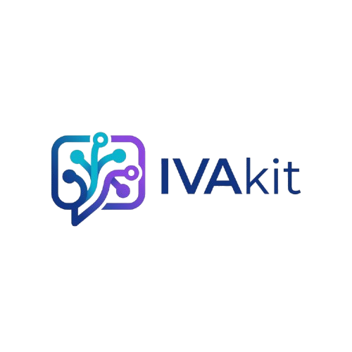
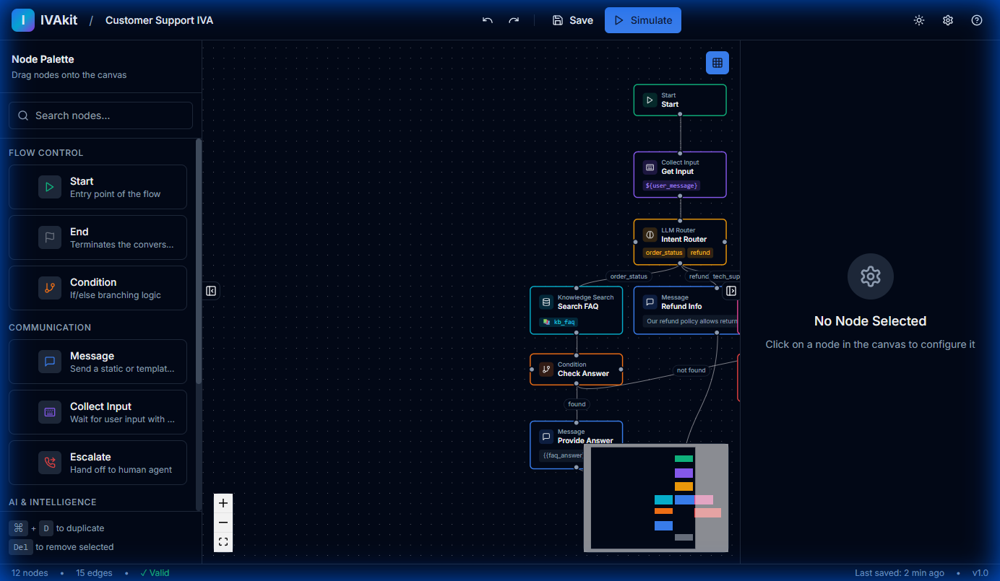
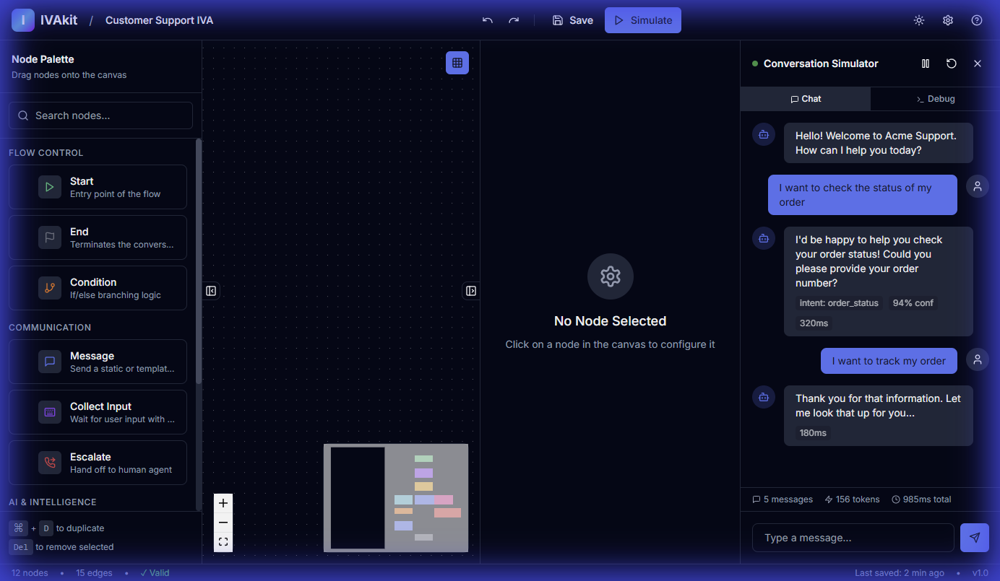
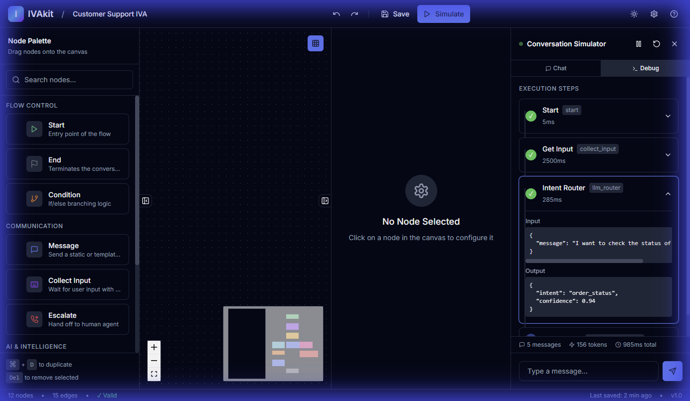

<p align="center">
  
</p>

<h1 align="center">IVAkit</h1>

<p align="center">
  <strong>Open-Source No-Code AI Virtual Agent Builder</strong>
</p>

<p align="center">
  <a href="#features">Features</a> •
  <a href="#screenshots">Screenshots</a> •
  <a href="#installation">Installation</a> •
  <a href="#usage">Usage</a> •
  <a href="#architecture">Architecture</a> •
  <a href="#node-types">Node Types</a> •
  <a href="#ai-integration">AI Integration</a>
</p>

---

## 🎯 Overview

**IVAkit** is a visual conversation builder and runtime execution engine for Intelligent Virtual Agents (IVAs). Designed for contact centers, CX teams, and AI engineers who want to create sophisticated conversational AI without the complexity.

### Key Highlights

- 🏠 **100% Local-First** – Run everything on your infrastructure
- 🎨 **Visual Builder** – Drag-and-drop flow design with 9 node types
- ⚡ **Real-time Simulator** – Test flows instantly with step-by-step debugging
- 🤖 **AI-Powered** – Optional local Ollama or cloud AI integration
- 📋 **Deterministic** – AI is a tool, not magic; everything is inspectable
- 🌙 **Premium UI** – Modern dark/light themes with smooth animations

---

## 📸 Screenshots

### Visual Flow Builder
The primary interface for building conversation flows. Drag nodes from the palette, connect them, and configure each step.



### Live Conversation Simulator
Test your flows in real-time with the built-in simulator. See intent detection, confidence scores, and execution timing.



### Execution Debugger
Step through every node with full input/output inspection. See exactly what data flows through your conversation.



---

## ✨ Features

### Visual Flow Builder
- **Drag & Drop Canvas** – Build flows visually with React Flow
- **9 Node Types** – Start, Message, Collect Input, LLM Router, Knowledge Search, Tool Call, Condition, Escalate, End
- **Real-time Validation** – Instant feedback on flow errors
- **Undo/Redo** – Full history with keyboard shortcuts (Ctrl+Z / Ctrl+Y)
- **Dark & Light Themes** – Toggle with one click
- **Export/Import** – Save flows as JSON, share with teammates
- **Keyboard Shortcuts** – Press ? for full reference

### Conversation Simulator
- **Live Execution** – Test flows as you build
- **Intent Detection** – See how LLM classifies user messages
- **Confidence Scores** – Understand AI certainty
- **Step-by-Step Debug** – Inspect every node's input/output
- **Token & Latency Metrics** – Monitor performance
- **Reset & Replay** – Quick iteration

### Runtime Engine
- **JSON Flow Definitions** – Version-controlled conversation logic
- **Session State** – Maintains context across turns
- **Channel Agnostic** – Works with any frontend
- **Deterministic** – Reproducible except for LLM calls
- **Full Audit Logging** – Every decision is traceable

---

## 🚀 Installation

### Prerequisites

- **Node.js** 20+ (required)
- **pnpm** 8+ (required)
- **Ollama** (optional, for local AI)

### Quick Start

```bash
# Clone the repository
git clone https://github.com/ryanshatz/IVAkit.git
cd IVAkit

# Install dependencies
pnpm install

# Run in development mode
pnpm dev
```

The application will open at **http://localhost:3000**

### Docker Setup

For production or isolated environments:

```bash
# Start all services
docker-compose up -d

# Services available:
# - Studio:  http://localhost:3000
# - API:     http://localhost:3001
# - Ollama:  http://localhost:11434
```

### Optional: Local AI with Ollama

For enhanced AI capabilities without cloud dependencies:

```bash
# Install Ollama (https://ollama.ai)
curl -fsSL https://ollama.ai/install.sh | sh

# Pull a model
ollama pull llama3.2

# IVAkit auto-connects to localhost:11434
```

---

## 💻 Usage

### Building a Flow

1. **Drag nodes** from the left palette onto the canvas
2. **Connect nodes** by dragging from one handle to another
3. **Configure nodes** by clicking to open the right panel
4. **Validate** – Check the status bar for any errors

### Testing with Simulator

1. Click **"Simulate"** in the header
2. Type messages in the chat input
3. Watch the **Debug** tab to see execution
4. View **intent detection** and **confidence scores**

### Keyboard Shortcuts

| Shortcut | Action |
|----------|--------|
| `Ctrl+Z` | Undo |
| `Ctrl+Shift+Z` | Redo |
| `Ctrl+S` | Save flow |
| `Ctrl+E` | Export flow |
| `Ctrl+I` | Import flow |
| `Ctrl+D` | Duplicate node |
| `Delete` | Delete node |
| `?` | Show help |

---

## 🏗️ Architecture

```
IVAkit/
├── apps/                      # Applications
│   ├── studio/                # Next.js visual builder
│   │   ├── src/
│   │   │   ├── app/           # Pages and layouts
│   │   │   ├── components/    # React components
│   │   │   └── store/         # Jotai state management
│   │   └── package.json
│   │
│   └── api/                   # Hono API server
│       └── src/
│           ├── router.ts      # tRPC routes
│           └── context.ts     # Request context
│
├── packages/                  # Shared packages
│   ├── shared/                # Types, schemas, utils
│   ├── database/              # Drizzle ORM + SQLite
│   ├── runtime/               # Flow execution engine
│   └── ai/                    # AI provider adapters
│
└── docs/                      # Documentation
    ├── flow-spec.md           # Flow specification
    └── screenshots/           # App screenshots
```

### Technology Stack

| Layer | Technology |
|-------|------------|
| Frontend | Next.js 14, React 18, TypeScript, Tailwind CSS |
| State | Jotai, React Flow |
| Animations | Framer Motion |
| Icons | Lucide React |
| Backend | Hono, tRPC, Bun |
| Database | SQLite (via Drizzle ORM) |
| AI | Ollama (local), OpenAI, Anthropic |

---

## 📦 Node Types

IVAkit includes 9 specialized node types across 4 categories:

| Node | Icon | Category | Purpose |
|------|:----:|----------|---------|
| Start | 🟢 | Flow Control | Entry point with welcome message |
| End | ⬛ | Flow Control | Terminate with goodbye message |
| Condition | 🔀 | Flow Control | If/else branching logic |
| Message | 💬 | Communication | Send response to user |
| Collect Input | 📝 | Communication | Gather and validate user input |
| Escalate | 🚨 | Communication | Human handoff to agent queue |
| LLM Router | 🧠 | AI & Intelligence | AI-powered intent classification |
| Knowledge Search | 📚 | AI & Intelligence | RAG retrieval from knowledge base |
| Tool Call | 🔧 | AI & Intelligence | External API integration |

### Node Detection Methods

1. **LLM Classification** – AI analyzes user messages with system prompts
2. **Keyword Matching** – Fallback rules-based detection
3. **Conditions** – Variable-based branching with operators

---

## 🤖 AI Integration

IVAkit supports multiple AI providers with a unified interface:

### Supported Providers

| Provider | Type | Models |
|----------|------|--------|
| Ollama | Local | llama3.2, mistral, gemma |
| OpenAI | Cloud | gpt-4, gpt-4o, gpt-3.5-turbo |
| Anthropic | Cloud | claude-3-opus, claude-3-sonnet |
| Rules | Fallback | Keyword-based (no AI) |

### How It Works

1. **LLM Router nodes** send user messages to the configured provider
2. **System prompt** includes all defined intents with descriptions
3. **Structured output** returns intent name and confidence score
4. **Routing** – Flow continues to the matching intent's target node

### Ollama vs Cloud Mode

| Feature | Ollama (Local) | Cloud (OpenAI/Anthropic) |
|---------|----------------|--------------------------|
| Privacy | ✅ 100% local | Data sent to provider |
| Speed | ~1-2 seconds | ~0.5-1 second |
| Cost | Free | Per-token pricing |
| Setup | Requires Ollama | API key only |
| Offline | ✅ Yes | ❌ No |

---

## 🗺️ Roadmap

| Version | Focus | Features |
|---------|-------|----------|
| v0.2 | Enhancement | Flow versioning, variable types, webhook channel |
| v0.3 | Voice | WebRTC, Twilio Streams, speech-to-text |
| v1.0 | Enterprise | Multi-tenant, RBAC, deployment pipelines |
| Beyond | Ecosystem | CCaaS integrations, A/B testing, plugin marketplace |

---

## ⚠️ Philosophy

> **IVAkit IVAs are *systems*, not chatbots.**
>
> - **Deterministic first, LLM second** – AI is a tool, not magic
> - **Local-first by default** – Run everything on your infrastructure
> - **No magic hidden behavior** – Everything is inspectable
> - **Composable artifacts** – Flows are versioned JSON

---

## 📄 License

MIT License - See [LICENSE](LICENSE) for details.

---

## 🙏 Acknowledgments

- [React Flow](https://reactflow.dev/) – For the visual graph editor
- [Ollama](https://ollama.ai/) – For local LLM inference
- [shadcn/ui](https://ui.shadcn.com/) – For beautiful components
- [Framer Motion](https://www.framer.com/motion/) – For smooth animations
- [tRPC](https://trpc.io/) – For type-safe APIs
- [Drizzle](https://orm.drizzle.team/) – For database ORM

---

<p align="center">
  Built with ❤️ for Contact Centers
</p>

<p align="center">
  © 2026 IVAkit • v1.0.0
</p>
